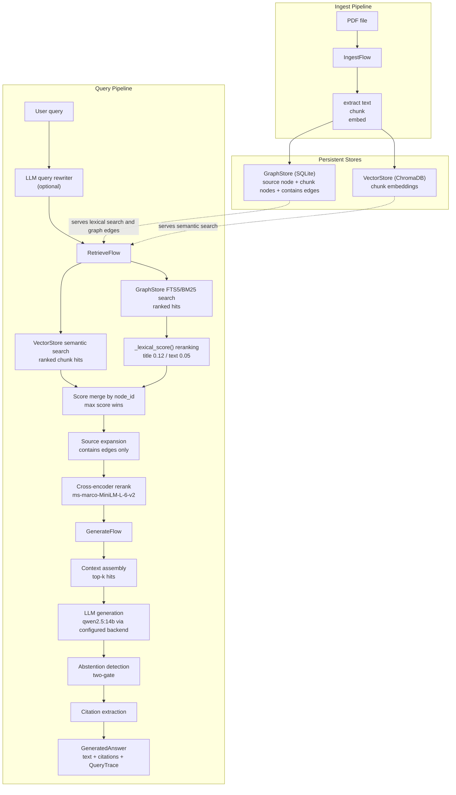

# Research Continuity Agent (RCA)

A **local-first research knowledge system** that ingests technical PDFs, performs hybrid retrieval over semantic and structured links, and generates grounded answers with source citations — built to support a Master's thesis on structured visual perception for robotic inventory generation.

---

## System Diagram



The system composes FTS5/BM25 lexical search, dense vector retrieval, source graph expansion, and a final cross-encoder rerank into a single ranked bundle. A two-gate abstention mechanism detects when the corpus lacks sufficient evidence. All query stages are traced with per-stage latency and retrieval provenance.

## Reproducing Results

```bash
# Run retrieval ablations on the current golden set
uv run python eval/run_ablations.py

# Run generation harness on the same golden set
uv run python eval/harness.py
```

The checked-in golden set currently contains `100` questions: `90` answerable and `10` explicit negative / unanswerable queries. Refresh `eval/results/` locally after any corpus or backend change.

---

## What it does

Given a corpus of research PDFs, RCA:

1. **Ingests** documents into a dual-store (vector embeddings + structured graph)
2. **Rewrites** queries before retrieval to improve keyword density and recall
3. **Retrieves** via hybrid search: semantic vector similarity + graph keyword search + graph neighbourhood expansion
4. **Generates** grounded answers with inline citations enforced at the prompt level
5. **Evaluates** answer quality against a golden Q&A set with retrieval, citation, and keyword metrics

## Design notes

Orchestration is handled directly via `RetrieveFlow` and `GenerateFlow`. A LangGraph-based agent workflow is on the roadmap.

**Why two stores?**

| Store | Role | Justification |
|---|---|---|
| ChromaDB | Semantic retrieval index | Fast approximate nearest-neighbour over dense embeddings |
| SQLite (graph) | Document registry, provenance, entity links | Structured traversal, explainable expansion, zero-dependency deployment |

Golden pairs and eval outputs live as JSON artifacts under `eval/`. The graph is not decorative — it enables chunk-to-source resolution, neighbour expansion for related content, and provenance tracking that vector search cannot provide alone.

---

## Component details

**Knowledge store.** Two persistent stores back the system. `GraphStore` holds typed nodes and directed edges in a local SQLite database. Node kinds are `source`, `chunk`, `note`, `paper`, `experiment`, and `digest`; edge kinds are `contains`, `derived_from`, `references`, `cites`, `related_to`, and `produced_by`. The same SQLite database also maintains an FTS5 virtual table, and BM25 is now the production lexical search path. The original token-wise `LIKE` implementation is still retained as `search_nodes_like()` for reference and regression testing because it documents the earlier design that was later outperformed in ablation. `VectorStore` wraps ChromaDB with an Ollama embedding function using `nomic-embed-text` (768 dimensions, cosine similarity). When ChromaDB is unavailable, it falls back to a JSON file with bag-of-words cosine scoring.

**ID system.** All identifiers are stable and deterministic. Source nodes follow the pattern `src:namespace/name` (e.g., `src:pdf/attention-is-all-you-need`). Chunk nodes derive from their source: `chk:namespace/name:0000`. Identifiers are validated with regular expressions at the contract boundary so invalid IDs cannot enter the stores.

**MCP servers.** Two MCP servers expose tools over stdio. The filesystem server sandboxes all path resolution to a configured root directory and delegates text search to ripgrep. The experiments server provides full CRUD for experiment runs (record, list, update, get) with a status lifecycle of `pending → running → complete / failed`, backed by a separate SQLite database.

**Ingest flow.** `IngestFlow.ingest_path` dispatches on file type: `.pdf` → `PDFExtractor`, `.md`/`.txt` → `NoteExtractor`, `.json`/`.yaml` → `ExperimentExtractor`, directory → `GitExtractor`. Extracted text is split into boundary-aware chunks (default 1200 characters, 150 overlap) that prefer paragraph breaks, then newlines, then word boundaries before hard-cutting. Each chunk becomes a graph node linked to its source via a `contains` edge, and all chunks are upserted into the vector store in a single batch call.

**Retrieve flow.** `RetrieveFlow.retrieve` composes vector similarity search with lexical graph search over SQLite FTS5/BM25. The earlier token-wise `LIKE` path is still available as `GraphStore.search_nodes_like()` for reference/testing, but it is no longer the production retrieval backbone because explicit evaluation showed BM25 was materially stronger. RetrieveFlow reranks lexical candidates with exact word-token overlap over title and text before merging by node ID, promotes parent source nodes from chunk hits via `_expand_to_sources`, and now applies a final cross-encoder rerank (`cross-encoder/ms-marco-MiniLM-L-6-v2`) over the merged candidate set before returning the top bundle.

**Generate flow.** `GenerateFlow.generate_answer` is a three-step pipeline:
1. **Query routing + rewriting** — a lightweight query classifier labels the question as `proper_noun`, `conceptual`, or `hybrid`. Proper-noun queries skip the LLM rewrite entirely; the other classes still produce a dense 8–12 keyword technical search query to improve vector recall over conversational phrasing.
2. **Grounded context** — the rewritten query is passed to `RetrieveFlow`; hits scoring above 0.55 (or any `src:` node) are formatted into a bracketed context block. If the rewritten query yields no context, the pipeline retries with the original raw query.
3. **Citation-enforced generation** — the LLM is instructed to follow every factual claim with `[[source_id]]` using the exact IDs from the context block when enough evidence exists. After generation, `_extract_citations` resolves cited IDs against the hit map, normalising chunk-style IDs (e.g. `chk:pdf/paper:0009`) to their parent source even when the final bundle is chunk-heavy. A two-gate abstention check then detects unsupported answers using hedge phrases plus retrieval confidence.

**LLM client.** `OllamaLLMClient` defaults to local Ollama (`/api/chat`, `/api/embeddings`) and now also supports OpenAI-compatible endpoints when `RCA_LLM_BASE_URL` and `RCA_LLM_API_KEY` are configured. The default generation model is `qwen2.5:14b`; embeddings use `nomic-embed-text`. `EchoLLMClient` is a deterministic stub for tests.

**Contracts layer.** `rca/contracts/` defines the identifier rules, node/edge models, and other shared DTOs that every other layer imports. No layer other than `store` performs persistence; no persistence layer makes model calls.

**Streamlit UI.** `app.py` provides a browser interface with two modes. *Research Chat* accepts natural-language questions and streams grounded answers with inline citation cards and a `✓ grounded` / `⚠ unverified` badge. *Research Workspace* has three tabs: Ingest (drag-and-drop PDF upload, single or batch), Knowledge Map (interactive Plotly/NetworkX graph of source nodes and edges), and Store (searchable list of all ingested items). The sidebar shows live paper/chunk counts and supports dark/light theme toggling.

---

## Storage layout

```
.rca/
├── vectors/          # ChromaDB persistent store
└── graph.sqlite3     # Document graph and metadata
```

---

## Stack

| Layer | Choice | Reason |
|---|---|---|
| Embeddings | nomic-embed-text (Ollama) | Local, fast, strong retrieval quality |
| Generation | qwen2.5:14b (Ollama) | Best local model for structured grounded generation |
| Vector DB | ChromaDB | Persistent, zero-infrastructure prototype |
| Graph/metadata | SQLite | Zero-dependency, portable, easy to audit |
| UI | Streamlit | Prototype interface — FastAPI migration planned |
| Orchestration | Direct flow composition | `RetrieveFlow` and `GenerateFlow` are called directly today; an agent workflow is future work |

---

## Evaluation

RCA is currently evaluated on **100 golden questions**: `90` answerable and `10` explicit negative / unanswerable queries.

The checked-in eval assets now include:
- `eval/golden.json` with the full 100-question corpus
- `eval/splits/dev.json` and `eval/splits/test.json` with a stratified `69 / 31` split
- `eval/harness.py` for answer-level evaluation over all `100` questions
- `eval/run_ablations.py` for retrieval-only evaluation over the `90` answerable questions
- `eval/run_coefficient_sweep.py` for held-out lexical-reranker tuning on the current split

Latest local artifacts:
- `eval/results/run_20260316T191249Z.json`
- `eval/results/ablations.json`

Current generation results on the 100-question corpus:

| Metric | Value |
|---|---|
| Citation precision (answerable, non-abstained) | `91.0%` over `89` cases |
| Negative abstention recall | `2/10` (`20.0%`) |
| Answerable abstentions | `1` |
| Average keyword hit rate | `0.265` |
| Average latency | `11.8 s` |

Current retrieval baselines — hit@5 / hit@10 (`n=90` answerable):

| Configuration | hit@5 | hit@10 |
|---|---:|---:|
| 0. fts5-only (BM25 baseline) | `95.6%` | `98.9%` |
| 1. vector-only (dense baseline) | `76.7%` | `88.9%` |
| 2. vector + keyword (FTS5) | `76.7%` | `88.9%` |
| 3. vector + keyword + expansion | `94.4%` | `96.7%` |
| 4. full pipeline (+ query rewrite) | `87.8%` | `96.7%` |

The most important current evaluation takeaways are:
- FTS5/BM25 remains the strongest single-method retrieval baseline on this corpus.
- Source expansion is still the biggest lift over dense retrieval alone.
- Query rewriting is still mixed and now clearly hurts hit@5 on the full 100-question set.
- Abstention is still heuristic and remains one of the main thesis-facing limitations.

Live metrics depend on the local Ollama/Chroma environment, so the right way to refresh results is to rerun the eval scripts on the target machine rather than trusting stale checked-in numbers after a corpus change. The detailed evaluation notes live in `docs/EVAL.md`.

---

## Roadmap

### v1.1 — Local system (current)

- [x] PDF ingest → chunking → dual-store (vector + graph)
- [x] Hybrid retrieval (vector + keyword search + graph expansion)
- [x] Query rewriting before retrieval
- [x] Grounded answer generation with citation enforcement
- [x] Streamlit UI (chat + ingest + knowledge map + store)
- [x] Integration tests
- [x] Evaluation harness with golden Q&A pairs
- [x] **Fix citation precision** — source-ID resolution bug
- [x] **Retrieval baselines and ablations** — FTS5/BM25, dense-only, LIKE, graph expansion, rewrite
- [x] **Retrieval ranking hardening** — exact-word title/text rescoring to remove partial-word false positives
- [x] **Expand golden set** — 30 → 100 grounded questions
- [x] Observability — per-stage latency, token usage, retrieval provenance
- [x] Docker + one-command local boot
- [ ] **Add a human-authored external eval subset** — reduce self-bias for thesis reporting
- [ ] arxiv MCP server
- [ ] Zotero MCP server
- [ ] Weekly digest generator

### v2 — Production-shaped deployment

- FastAPI backend (replace Streamlit)
- Next.js frontend
- Background ingest worker (async)
- Object storage for raw PDFs (S3 or equivalent)
- Postgres + pgvector (replace ChromaDB in cloud deployment)
- Structured logs + metrics dashboard
- GitHub Actions CI (lint + tests + smoke deploy)
- Docker Compose
- Optional auth / multi-user namespaces

---

## Setup

**Requirements:** Python 3.11+, [uv](https://docs.astral.sh/uv/), [Ollama](https://ollama.com), [ripgrep](https://github.com/BurntSushi/ripgrep)

```bash
brew install ripgrep

# Pull models
ollama pull nomic-embed-text   # embeddings (768-dim)
ollama pull qwen2.5:14b        # answer generation and query rewriting

# Install dependencies
uv sync

# Configure environment
cp .env.example .env
```

Key environment variables:

| Variable | Default | Description |
|---|---|---|
| `RCA_WORKSPACE_ROOT` | current directory | Root of the research workspace exposed to the filesystem server |
| `RCA_DATA_DIR` | `.rca` | Directory where all runtime data is stored |
| `RCA_CHUNK_SIZE` | `1200` | Target chunk size in characters |
| `RCA_CHUNK_OVERLAP` | `150` | Overlap between consecutive chunks |
| `RCA_GENERATION_MODEL` | `qwen2.5:14b` | Ollama model used for answer generation and query rewriting |
| `RCA_EMBEDDING_MODEL` | `nomic-embed-text` | Ollama model used for vector embeddings |
| `RCA_LLM_BASE_URL` | `http://localhost:11434` | Base URL for the generation/chat API; defaults to local Ollama, but can point to any OpenAI-compatible endpoint |
| `RCA_LLM_API_KEY` | `ollama` | API key for the configured LLM endpoint; ignored by default local Ollama |
| `ANONYMIZED_TELEMETRY` | `False` | Disable ChromaDB telemetry |

Runtime directories under `.rca/` are created automatically on first use.

To use any OpenAI-compatible endpoint (OpenAI, Groq, local vLLM, etc.), set `RCA_LLM_BASE_URL` and `RCA_LLM_API_KEY` in your `.env` file. Unprefixed `LLM_BASE_URL` and `LLM_API_KEY` are also accepted for convenience.

> **Always use `uv run python`.** Never bare `python` — the system Python lacks ChromaDB and silently falls back to the JSON backend, returning 0 documents.

---

## Usage

**Launch the UI**

```bash
uv run streamlit run app.py
```

Opens at `http://localhost:8501`. Use *Research Chat* to ask questions about ingested papers. Use *Workspace → Ingest* to drag-and-drop PDFs directly from Finder.

**Ingest documents**

```bash
uv run rca-ingest path/to/papers/
```

Or programmatically:

```python
from rca.flows.ingest_flow import IngestFlow

flow = IngestFlow()
result = flow.ingest_path("papers/some-robotics-paper.pdf")

print(f"source_id : {result.source_id}")
print(f"chunks    : {len(result.chunk_ids)}")
print(f"nodes     : {result.node_count}")
print(f"edges     : {result.edge_count}")
```

**Ask a question and get a grounded answer**

```python
from rca.flows.generate_flow import GenerateFlow

g = GenerateFlow()
result = g.generate_answer("What methods are used for robotic bin packing?")

print("Grounded:", result.grounded)
for c in result.citations:
    print(f"  [{c.source_id}] {c.title}")
print(result.answer)
```

**Query the retrieval layer directly**

```python
from rca.flows.retrieve_flow import RetrieveFlow

r = RetrieveFlow()
bundle = r.retrieve("structured perception inventory generation pipeline", limit=10)

for hit in bundle.hits:
    print(f"[{hit.score:.3f}] {hit.node_id}")
    print(hit.excerpt[:200])
    print()
```

**Run tests**

```bash
uv run pytest -v
uv run pytest tests/integration/test_ingest_flow.py
uv run pytest tests/unit/test_retrieve_flow.py
```

**Run evaluation harness**

```bash
uv run python eval/harness.py
uv run python eval/run_ablations.py
```

---

## Project structure

```
.
├── app.py                      # Streamlit UI — Research Chat and Workspace
├── .streamlit/
│   └── config.toml             # Theme configuration (base: dark)
├── rca/                        # Main package
│   ├── config/                 # Settings (pydantic-settings, RCA_ env prefix) and tool policies
│   ├── contracts/              # Shared data models: node/edge types, ID rules, citations, traces
│   ├── store/                  # Persistence only: GraphStore (SQLite), VectorStore (ChromaDB), EventLog
│   │   └── migrations/         # SQL schema applied on GraphStore init
│   ├── extractors/             # Turn files into text payloads: PDF, Markdown, Git, Experiment
│   ├── flows/                  # Compose extractors and stores into workflows
│   │   ├── ingest_flow.py      # File → chunks → graph + vector store
│   │   ├── retrieve_flow.py    # Vector + lexical search, graph expansion, scored bundles
│   │   └── generate_flow.py    # Query rewriting → retrieval → grounded LLM answer
│   ├── llm/                    # LLM client interface: OllamaLLMClient, EchoLLMClient
│   ├── orchestrator/           # Routing helpers and typed state models
│   ├── telemetry/              # Tracing and metrics instrumentation (skeletal)
│   └── mcp_servers/
│       ├── filesystem/         # MCP server: sandboxed file access and ripgrep search
│       ├── experiments/        # MCP server: experiment run CRUD over SQLite
│       ├── arxiv/              # Reserved — not implemented
│       ├── zotero/             # Reserved — not implemented
│       └── git/                # Reserved — not implemented
├── cli/                        # Entry points: rca-ingest, rca-query
├── eval/                       # Golden question set, evaluation harness, and run results
├── tests/
│   ├── unit/                   # Contract and store unit tests
│   └── integration/            # End-to-end ingest and generate flow tests
└── docs/                       # Architecture, data model, and evaluation documentation
```

---

## Project context

Built alongside a Master's thesis at Instituto Superior Técnico on *Structured Perception for Packing-Relevant Inventory Generation* — a system that generates machine-readable grocery inventories from RGB images for robotic bagging. RCA serves as the research memory layer: ingesting related papers, tracking design decisions, and enabling grounded retrieval over the full literature corpus.
