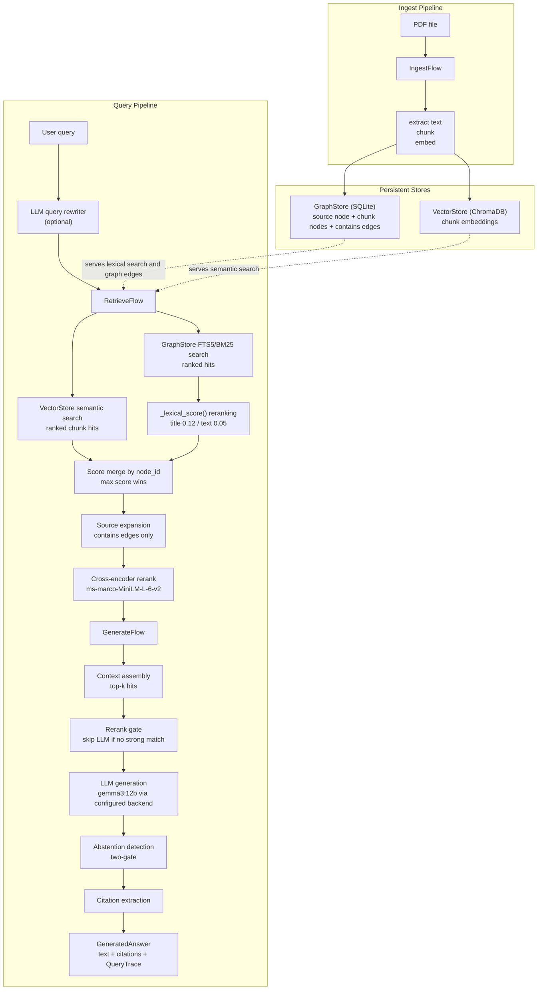

# Research Continuity Agent (RCA)


A **local-first research knowledge system** that ingests technical PDFs, performs hybrid retrieval over semantic and structured links, and generates grounded answers with source citations — built around research on structured visual perception for robotic inventory generation.

---

## System Diagram


```mermaid
flowchart TD
    subgraph Ingest["Ingest Pipeline"]
        PDF["PDF file"]
        IF["IngestFlow"]
        Extract["extract text<br/>chunk<br/>embed"]
        PDF --> IF --> Extract
    end

    subgraph Storage["Persistent Stores"]
        GS["GraphStore (SQLite)<br/>source node + chunk nodes + contains edges"]
        VS["VectorStore (ChromaDB)<br/>chunk embeddings"]
    end

    subgraph Query["Query Pipeline"]
        UQ["User query"]
        RW["LLM query rewriter<br/>(optional)"]
        RF["RetrieveFlow"]
        VQ["VectorStore semantic search<br/>ranked chunk hits"]
        FTS["GraphStore FTS5/BM25 search<br/>ranked hits"]
        LEX["_lexical_score() reranking<br/>title 0.12 / text 0.05"]
        MERGE["Score merge by node_id<br/>max score wins"]
        EXPAND["Source expansion<br/>contains edges only"]
        RERANK["Cross-encoder rerank<br/>ms-marco-MiniLM-L-6-v2"]
        GF["GenerateFlow"]
        CTX["Context assembly<br/>top-k hits"]
        LLM["LLM generation<br/>gemma3:12b via configured backend"]
        ABS["Abstention detection<br/>two-gate"]
        CITE["Citation extraction"]
        OUT["GeneratedAnswer<br/>text + citations + QueryTrace"]

        UQ --> RW --> RF
        RF --> VQ --> MERGE
        RF --> FTS --> LEX --> MERGE
        MERGE --> EXPAND --> RERANK --> GF
        GF --> CTX --> GATE["Rerank gate<br/>skip LLM if no strong match"] --> LLM --> ABS --> CITE --> OUT
    end

    Extract --> GS
    Extract --> VS
    GS -. "serves lexical search and graph edges" .-> RF
    VS -. "serves semantic search" .-> RF
```

The system composes FTS5/BM25 lexical search, dense vector retrieval, source graph expansion, and a final cross-encoder rerank into a single ranked bundle. A calibrated reranker-score gate skips generation when nothing in the corpus matches, and a post-generation check (hedge phrases, citation validity, retrieval confidence) catches unsupported answers. All query stages are traced with per-stage latency and retrieval provenance.

## Reproducing Results

```bash
# Run retrieval ablations on the current golden set
uv run python eval/run_ablations.py

# Run generation harness on the same golden set
uv run python eval/harness.py --model gemma3:12b
```

The checked-in golden set currently contains `129` questions: `90` answerable and `39` explicit negative / unanswerable queries. Refresh `eval/results/` locally after any corpus or backend change.

---

## What it does

Given a corpus of research PDFs, RCA:

1. **Ingests** documents into a dual-store (vector embeddings + structured graph)
2. **Rewrites** queries before retrieval to improve keyword density and recall
3. **Retrieves** via hybrid search: semantic vector similarity + graph keyword search + graph neighbourhood expansion
4. **Generates** grounded answers with inline citations enforced at the prompt level
5. **Executes** a multi-turn agent loop for knowledge-base search plus read-only filesystem and experiment inspection
6. **Evaluates** answer quality against a golden Q&A set with retrieval, citation, and keyword metrics

## Design notes

Grounded chat is still handled directly via `RetrieveFlow` and `GenerateFlow`, while the agent mode uses a separate multi-turn tool loop.

**Why two stores?**

| Store | Role | Justification |
|---|---|---|
| ChromaDB | Semantic retrieval index | Fast approximate nearest-neighbour over dense embeddings |
| SQLite (graph) | Document registry, provenance, entity links | Structured traversal, explainable expansion, zero-dependency deployment |

Golden pairs and eval outputs live as JSON artifacts under `eval/`. The graph is not decorative — it enables chunk-to-source resolution, neighbour expansion for related content, and provenance tracking that vector search cannot provide alone.

---

## Component details

**Knowledge store.** Two persistent stores back the system. `GraphStore` holds typed nodes and directed edges in a local SQLite database. Node kinds are `source`, `chunk`, `note`, `paper`, `experiment`, and `digest`; edge kinds are `contains`, `derived_from`, `references`, `cites`, `related_to`, and `produced_by`. The same SQLite database also maintains an FTS5 virtual table, and BM25 is now the production lexical search path. The original token-wise `LIKE` implementation is still retained as `search_nodes_like()` for reference and regression testing because it documents the earlier design that was later outperformed in ablation. `VectorStore` wraps ChromaDB with a configurable embedding function routed through the RCA client boundary, so the default local `nomic-embed-text` path and OpenAI-compatible embedding APIs share one integration layer. When ChromaDB is unavailable or fails at runtime, it falls back to a JSON file with bag-of-words cosine scoring; the fallback is reported in `/status` (`vector_backend`, `warnings`), the React status bar, and the Streamlit sidebar.

**ID system.** All identifiers are stable and deterministic. Source nodes follow the pattern `src:namespace/name` (e.g., `src:pdf/attention-is-all-you-need`). Chunk nodes derive from their source: `chk:namespace/name:0000`. Identifiers are validated with regular expressions at the contract boundary so invalid IDs cannot enter the stores.

**MCP servers.** Two MCP servers expose tools over stdio. The filesystem server sandboxes all path resolution to a configured root directory and delegates text search to ripgrep. The experiments server provides full CRUD for experiment runs (record, list, update, get) with a status lifecycle of `pending → running → complete / failed`, backed by a separate SQLite database. The agent loop currently uses these servers in read-only mode for `list/read/search` on the filesystem and `list/get` for experiment runs.

**Ingest flow.** `IngestFlow.ingest_path` dispatches on file type: `.pdf` → `PDFExtractor`, `.md`/`.txt` → `NoteExtractor`, `.json`/`.yaml` → `ExperimentExtractor`, directory → `GitExtractor`. Extracted text is split into boundary-aware chunks (default 1200 characters, 150 overlap) that prefer paragraph breaks, then newlines, then word boundaries before hard-cutting. Each chunk becomes a graph node linked to its source via a `contains` edge, and all chunks are upserted into the vector store in a single batch call. Re-ingest is idempotent: file and content hashes resolve the same logical `source_id`, unchanged content skips writes, changed content atomically replaces the active chunk/vector set, and every revision is recorded in `source_revisions`.

**Retrieve flow.** `RetrieveFlow.retrieve` composes vector similarity search with lexical graph search over SQLite FTS5/BM25. The earlier token-wise `LIKE` path is still available as `GraphStore.search_nodes_like()` for reference/testing, but it is no longer the production retrieval backbone because explicit evaluation showed BM25 was materially stronger. RetrieveFlow reranks lexical candidates with exact word-token overlap over title and text before merging by node ID, promotes parent source nodes from chunk hits via `_expand_to_sources`, and now applies a final cross-encoder rerank (`cross-encoder/ms-marco-MiniLM-L-6-v2`) over the merged candidate set. When truncating to the top `k`, the first `k-1` hits keep their rank and the last slot goes to the best-ranked paper not already shown whose rerank score is above `-6.0` (`RCA_RETRIEVAL_RESERVE_NEW_SOURCE`, `RCA_RETRIEVAL_RESERVE_MIN_RERANK_SCORE`), so one paper's chunks are less likely to crowd a second relevant paper out of the context (set the floor to `-inf` to disable it).

**Generate flow.** `GenerateFlow.generate_answer` is a three-step pipeline:
1. **Query routing + rewriting** — a lightweight query classifier labels the question as `proper_noun`, `conceptual`, or `hybrid`. Proper-noun queries skip the LLM rewrite entirely; the other classes still produce a dense 8–12 keyword technical search query to improve vector recall over conversational phrasing.
2. **Grounded context** — the rewritten query is passed to `RetrieveFlow`; hits scoring above 0.55 (or any `src:` node) are formatted into a bracketed context block. If the rewritten query yields no context, the pipeline retries with the original raw query.
3. **Citation-enforced generation** — the LLM is instructed to follow every factual claim with `[[source_id]]` using the exact IDs from the context block when enough evidence exists. After generation, `_extract_citations` resolves cited IDs against the hit map, normalising chunk-style IDs (e.g. `chk:pdf/paper:0009`) to their parent source even when the final bundle is chunk-heavy. Before generation, a reranker-score gate (`max rerank_score <= -3.618`, calibrated in `eval/calibrate_abstention.py`) abstains without calling the LLM when no retrieved chunk is a strong match. After generation, an abstention check combines hedge phrases, citation validity, and retrieval confidence.

**LLM client.** `OllamaLLMClient` now sits behind a small factory and supports both local Ollama and OpenAI-compatible `/v1` endpoints for chat, tool use, and embeddings. The default local models are `gemma3:12b` for generation and `nomic-embed-text` for embeddings. The agent loop uses the same client boundary as grounded chat. `EchoLLMClient` is a deterministic stub for tests.

**Contracts layer.** `rca/contracts/` defines the identifier rules, node/edge models, and other shared DTOs that every other layer imports. No layer other than `store` performs persistence; no persistence layer makes model calls.

**UI surfaces.** `app.py` remains the local evaluation and development interface. The production UI migration now targets a Vite + React frontend backed by FastAPI. The information architecture is being consolidated so Chat is the primary landing surface, Agent is a secondary mode, and Workspace responsibilities move into a Library/Settings view plus a collapsible knowledge-map panel. Sidebar counters are being replaced by a status bar for papers, chunks, backend, and model state, plus a warning badge when vector search has fallen back to the JSON store.

---

## Storage layout

```
.rca/
├── vectors/          # ChromaDB persistent store
└── graph.sqlite3     # Document graph and metadata
```

---

## Stack

| Layer | Choice | Reason |
|---|---|---|
| Embeddings | nomic-embed-text (Ollama) | Local, fast, strong retrieval quality |
| Generation | gemma3:12b (Ollama) | Default local open-source model for grounded generation |
| Vector DB | ChromaDB | Persistent, zero-infrastructure prototype |
| Graph/metadata | SQLite | Zero-dependency, portable, easy to audit |
| UI | React (Vite) + FastAPI | Production frontend path; Streamlit retained for local dev/eval only |
| Orchestration | Mixed | Grounded chat uses direct flow composition; agent mode uses a separate multi-turn tool loop |

---

## Evaluation

RCA is currently evaluated on **129 golden questions**: `90` answerable and `39` explicit negative / unanswerable queries, typed by failure mode (unreported detail, false premise, out-of-corpus, fabricated, off-domain).

The checked-in eval assets now include:
- `eval/golden.json` with the full 129-question corpus
- `eval/splits/dev.json` and `eval/splits/test.json` with a stratified `69 / 31` split
- `eval/harness.py` for answer-level evaluation over all `129` questions
- `eval/run_agent_eval.py` for a 20-task sandboxed agent benchmark (tool selection, precision, steps, success; first run `12/20` with `qwen3.5:9b`)
- `eval/run_ablations.py` for retrieval-only evaluation over the `90` answerable questions
- `eval/run_coefficient_sweep.py` for held-out lexical-reranker tuning on the current split

Latest local artifacts:
- `eval/results/run_20260420T112737Z.json`
- `eval/results/ablations.json`

Current generation results on the 100-question corpus (production baseline `gemma3:12b`):

| Metric | Value |
|---|---|
| Citation precision (answerable, non-abstained) | `90.8%` over `87` cases |
| Negative abstention recall | `3/10` (`30.0%`) |
| Answerable abstentions | `3` |
| Average keyword hit rate | `0.205` |
| Average latency | `9.7 s` |
| Grounded rate | `94.0%` |

These numbers come from the 2026-04-21 `gemma3:12b` run on the original 100-question set (10 negatives), before the grounding check and failure labels landed; a fresh run is pending, together with a local model comparison (`gemma3:12b` / `gemma4:12b` / `qwen3.5:9b`).

Current retrieval baselines — hit@5 / hit@10 (`n=90` answerable):

| Configuration | hit@5 | hit@10 |
|---|---:|---:|
| 0. fts5-only (BM25 baseline) | `95.6%` | `98.9%` |
| 1. vector-only (dense baseline) | `84.4%` | `91.1%` |
| 2. vector + keyword (FTS5) | `84.4%` | `91.1%` |
| 3. vector + keyword + expansion | `95.6%` | `96.7%` |
| 4. full pipeline (+ query rewrite) | `95.6%` | `98.9%` |
| 5. production path (query-type aware) | `98.9%` | `98.9%` |

The most important current evaluation takeaways are:
- The production path (query-type-aware rewrite + hybrid retrieval + rerank + a reserved new-source slot) is the best configuration at `98.9%` hit@5 (2026-10-02); FTS5/BM25 remains the strongest single method.
- Source expansion is still the biggest lift over dense retrieval alone.
- Keyword hit rate remains the primary weakness (`20.5%`) and appears more sensitive to rewrite prompt quality than model choice.
- Split-model rewriting was evaluated and rejected for production: it added 10s+ latency for marginal quality gain.
- Agent mode is intentionally separated from grounded chat so tool-use experimentation does not affect the measured QA path.

Gemma 4 note:
- `gemma4:e4b` was re-evaluated and showed stronger citation precision (`93.5%`) and abstention recall (`50%`), but it is currently not the production default because latency (`30.1 s`) and answerable abstentions (`13`) are too high for daily use.

Live metrics depend on the local Ollama/Chroma environment, so the right way to refresh results is to rerun the eval scripts on the target machine rather than trusting stale checked-in numbers after a corpus change. The detailed evaluation notes live in `docs/EVAL.md`.

---

## Roadmap

### v1.x — Current shipped system

- [x] PDF ingest → chunking → dual-store (vector + graph)
- [x] Hybrid retrieval (vector + keyword search + graph expansion)
- [x] Query rewriting before retrieval
- [x] Grounded answer generation with citation enforcement
- [x] Streamlit local dev/eval UI (legacy chat/agent/workspace surface)
- [x] MCP agent loop — native knowledge-base adapter plus MCP stdio tools for filesystem and experiments
- [x] Integration tests
- [x] Evaluation harness with golden Q&A pairs
- [x] **Fix citation precision** — source-ID resolution bug
- [x] **Retrieval baselines and ablations** — FTS5/BM25, dense-only, LIKE, graph expansion, rewrite
- [x] **Retrieval ranking hardening** — exact-word title/text rescoring to remove partial-word false positives
- [x] **Expand golden set** — 30 → 100 grounded questions
- [x] **Expand negative set** — 10 → 39 typed unanswerable questions
- [x] Observability — per-stage latency, token usage, retrieval provenance
- [x] Docker + one-command local boot
- [x] GitHub Actions CI — Ruff + pytest, and frontend type-check (app and tests) + build + vitest on Node 24, on push / PR
- [x] AWS deployment-ready package — baked demo image, ECS task templates, one-off demo script
- [ ] FastAPI backend surface for `IngestFlow`, `RetrieveFlow`, and `GenerateFlow` HTTP endpoints
- [ ] React (Vite) frontend migration — Chat primary surface, Agent secondary mode, Library view for ingest/store, collapsible knowledge-map panel, status bar
- [ ] **Confidence-calibrated abstention** — improve negative handling without destabilizing grounded answers
- [ ] **Add a human-authored external eval subset** — reduce self-bias for external reporting
- [ ] arxiv MCP server
- [ ] Zotero MCP server
- [ ] Weekly digest generator

### v2 — Production-shaped deployment

- Background ingest worker (async)
- Object storage for raw PDFs (S3 or equivalent)
- Postgres + pgvector (replace ChromaDB in cloud deployment)
- Structured logs + metrics dashboard
- Cloud deploy automation / smoke deploy
- Optional auth / multi-user namespaces
- Optional SSR frontend (for multi-user/cloud scenarios; Next.js remains deferred)

---

## Setup

**Requirements:** Python 3.11+, [uv](https://docs.astral.sh/uv/), [ripgrep](https://github.com/BurntSushi/ripgrep). [Ollama](https://ollama.com) is required only for the default local backend.

If you run `phi4:14b` locally, close heavy applications (VS Code, browsers with many tabs) to avoid swap pressure. For daily use, `gemma3:12b` is the recommended default.

```bash
brew install ripgrep

# Pull models for the default local backend
ollama pull nomic-embed-text   # embeddings (768-dim)
ollama pull gemma3:12b         # answer generation and query rewriting

# Install dependencies
uv sync

# Configure environment
cp .env.example .env
```

Key environment variables:

| Variable | Default | Description |
|---|---|---|
| `RCA_WORKSPACE_ROOT` | current directory | Root of the research workspace exposed to the filesystem server |
| `RCA_DATA_DIR` | `.rca` | Directory where all runtime data is stored |
| `RCA_FILESYSTEM_ROOT` | current directory | Root exposed to the MCP filesystem tools and agent mode |
| `RCA_ENABLE_FILESYSTEM_TOOLS` | `true` | Enable or disable filesystem MCP tools for the agent loop |
| `RCA_CHUNK_SIZE` | `1200` | Target chunk size in characters |
| `RCA_CHUNK_OVERLAP` | `150` | Overlap between consecutive chunks |
| `RCA_LLM_BACKEND` | `ollama` | Backend selector for chat, tool use, and embeddings (`ollama` or `openai_compatible`) |
| `RCA_GENERATION_MODEL` | `gemma3:12b` | Ollama model used for answer generation and query rewriting |
| `RCA_AGENT_MODEL` | `qwen2.5:14b` | Ollama model for the tool-using agent loop (must support tool calling) |
| `RCA_LLM_THINK` | `false` | Ollama `think` flag; `true` only for thinking-capable models |
| `RCA_EMBEDDING_MODEL` | `nomic-embed-text` | Ollama model used for vector embeddings |
| `RCA_LLM_BASE_URL` | `http://localhost:11434` | Base URL for the local Ollama generation/chat API |
| `RCA_LLM_API_KEY` | `ollama` | API key for the configured LLM endpoint; ignored by default local Ollama |
| `RCA_OPENAI_BASE_URL` | `https://api.openai.com/v1` | Base URL for OpenAI-compatible chat and embedding APIs |
| `RCA_OPENAI_API_KEY` | empty | API key for the OpenAI-compatible backend |
| `RCA_OPENAI_CHAT_MODEL` | `gpt-4o-mini` | Chat model used when `RCA_LLM_BACKEND=openai_compatible` |
| `RCA_OPENAI_EMBED_MODEL` | `text-embedding-3-small` | Embedding model used when `RCA_LLM_BACKEND=openai_compatible` |
| `RCA_MODEL_RECOMMEND_INCLUDE` | empty list | Force-include model names in the picker recommendations |
| `RCA_MODEL_RECOMMEND_EXCLUDE` | empty list | Force-exclude model names from the picker |
| `RCA_MODEL_RECOMMEND_PREFERRED` | empty list | Optional preferred model names to boost in recommendation ranking |
| `ANONYMIZED_TELEMETRY` | `False` | Disable ChromaDB telemetry |

Runtime directories under `.rca/` are created automatically on first use.

To use any OpenAI-compatible endpoint (OpenAI, Groq, local vLLM, etc.), set `RCA_LLM_BACKEND=openai_compatible`, provide `RCA_OPENAI_API_KEY`, and override `RCA_OPENAI_BASE_URL` / model names as needed. The currently selected embedding model must match the embeddings used to build the active vector collection; switching providers for an existing corpus may require re-ingest.

For a production-shaped demo container, use `.env.production.example` as the starting point instead of `.env`. The deployment image defaults to `RCA_LLM_BACKEND=openai_compatible` and disables filesystem MCP tools unless you explicitly re-enable them.

### Model picker recommendation policy

Model discovery is dynamic: RCA reads available models from the active backend (`/api/tags` for Ollama) and computes recommendations from that live list. This is not a static list tied to one machine.

Current policy:

- Exclude obvious embedding-only models by name pattern (for example `embed`, `bge`, `e5`, `gte`, `nomic-embed`)
- Rank remaining models for text retrieval + synthesis (instruction-tuned and text-family boosts)
- Keep multimodal models as compatible candidates (some can still be strong for text workflows)
- Apply optional explicit overrides from `RCA_MODEL_RECOMMEND_INCLUDE`, `RCA_MODEL_RECOMMEND_EXCLUDE`, and `RCA_MODEL_RECOMMEND_PREFERRED`

The picker UI groups models into:

- `Recommended for RCA`
- `Other compatible`

This means different users with different local Ollama catalogs will naturally see different recommendations.

> **Always use `uv run python`.** Never bare `python` — the system Python lacks ChromaDB and silently falls back to the JSON backend, returning 0 documents.

### AWS demo path

The repo now includes a **cost-aware AWS deployment-ready package** under [infra/README.md](/Users/dmcp2003/Desktop/Universidade/Mestrado/Research-Continuity-Agent/infra/README.md). The intended student-friendly flow is:

1. build and push the image
2. run a short-lived ECS task for screenshots or a demo
3. tear it down immediately

Key artifacts:
- [infra/demo.sh](/Users/dmcp2003/Desktop/Universidade/Mestrado/Research-Continuity-Agent/infra/demo.sh) — one-off Fargate demo task with automatic teardown prompt
- [infra/deploy.sh](/Users/dmcp2003/Desktop/Universidade/Mestrado/Research-Continuity-Agent/infra/deploy.sh) — longer-lived ECS service deployment against pre-created infra
- [infra/teardown_service.sh](/Users/dmcp2003/Desktop/Universidade/Mestrado/Research-Continuity-Agent/infra/teardown_service.sh) — scale the ECS service back to zero
- [infra/ecs-task-def.json](/Users/dmcp2003/Desktop/Universidade/Mestrado/Research-Continuity-Agent/infra/ecs-task-def.json) — Fargate task definition template
- [infra/ecs-service.json](/Users/dmcp2003/Desktop/Universidade/Mestrado/Research-Continuity-Agent/infra/ecs-service.json) — ECS service template

This is deliberately a deployment-ready package, not a promise that RCA should stay live on AWS full time.

---

## Usage

**Launch the UI**

```bash
uv run streamlit run app.py
```

This Streamlit surface is now the local dev/eval interface. It is not the long-term production UI target.

Opens at `http://localhost:8501`. This remains the local dev/eval surface while production UX moves to Chat-first React + FastAPI information architecture.

**Launch the React/FastAPI bridge**

```bash
uv run uvicorn rca.api.main:app --reload --port 8000
cd frontend && npm run dev
```

The Vite app proxies `/api/*` to `http://localhost:8000/*` (the `/api` prefix is stripped). The API covers health/status, sources (with revision history), ingest, grounded chat, agent calls, model selection with tool-capability probing, and inline PDF fetch.

**Ingest documents**

```bash
uv run rca-ingest path/to/papers/
```

Or programmatically:

```python
from rca.flows.ingest_flow import IngestFlow

flow = IngestFlow()
result = flow.ingest_path("papers/some-robotics-paper.pdf")

print(f"source_id : {result.source_id}")
print(f"chunks    : {len(result.chunk_ids)}")
print(f"nodes     : {result.node_count}")
print(f"edges     : {result.edge_count}")
```

**Ask a question and get a grounded answer**

```python
from rca.flows.generate_flow import GenerateFlow

g = GenerateFlow()
result = g.generate_answer("What methods are used for robotic bin packing?")

print("Grounded:", result.grounded)
for c in result.citations:
    print(f"  [{c.source_id}] {c.title}")
print(result.answer)
```

**Query the retrieval layer directly**

```python
from rca.flows.retrieve_flow import RetrieveFlow

r = RetrieveFlow()
bundle = r.retrieve("structured perception inventory generation pipeline", limit=10)

for hit in bundle.hits:
    print(f"[{hit.score:.3f}] {hit.node_id}")
    print(hit.excerpt[:200])
    print()
```

**Run tests**

```bash
uv sync --extra dev   # pytest, ruff, pre-commit
uv run pytest -v
uv run pytest tests/integration/test_ingest_flow.py
uv run pytest tests/unit/test_retrieve_flow.py
```

**Git hooks**

```bash
uv sync --extra dev
uv run pre-commit install   # pre-commit: ruff check + format check; pre-push: CI pytest + frontend checks
```

Hooks check staged and untracked files (unstaged edits are stashed while they run), not the exact commit being pushed, so CI on the pushed commit stays the authoritative gate. The frontend part needs `npm ci` in `frontend/` once. If the committed `frontend/dist` is stale, its build step rewrites it and the push is blocked; commit the rebuilt dist and push again.

**Run evaluation harness**

```bash
uv run python eval/harness.py
uv run python eval/run_ablations.py
```

---

## Project structure

```
.
├── app.py                      # Streamlit local dev/eval UI (legacy chat/agent/workspace surface)
├── .streamlit/
│   └── config.toml             # Theme configuration (base: dark)
├── rca/                        # Main package
│   ├── config/                 # Settings (pydantic-settings, RCA_ env prefix) and tool policies
│   ├── contracts/              # Shared data models: node/edge types, ID rules, citations, traces
│   ├── store/                  # Persistence only: GraphStore (SQLite), VectorStore (ChromaDB), EventLog
│   │   └── migrations/         # SQL schema applied on GraphStore init
│   ├── extractors/             # Turn files into text payloads: PDF, Markdown, Git, Experiment
│   ├── flows/                  # Compose extractors and stores into workflows
│   │   ├── ingest_flow.py      # File → chunks → graph + vector store
│   │   ├── retrieve_flow.py    # Vector + lexical search, graph expansion, scored bundles
│   │   └── generate_flow.py    # Query rewriting → retrieval → grounded LLM answer
│   ├── agent/                  # Agent loop, MCP client manager, tool registry, trace contracts
│   ├── llm/                    # LLM client interface: OllamaLLMClient, EchoLLMClient
│   ├── orchestrator/           # Routing helpers and typed state models
│   ├── telemetry/              # Tracing and metrics instrumentation (skeletal)
│   └── mcp_servers/
│       ├── filesystem/         # MCP server: sandboxed file access and ripgrep search
│       ├── experiments/        # MCP server: experiment run CRUD over SQLite
│       ├── arxiv/              # Reserved — not implemented
│       ├── zotero/             # Reserved — not implemented
│       └── git/                # Reserved — not implemented
├── cli/                        # Entry points: rca-ingest, rca-query
├── eval/                       # Golden question set, evaluation harness, and run results
├── tests/
│   ├── unit/                   # Contract and store unit tests
│   └── integration/            # End-to-end ingest and generate flow tests
└── docs/                       # Architecture, data model, and evaluation documentation
```

---

## Project context

Built around research on *Structured Perception for Packing-Relevant Inventory Generation* — a system that generates machine-readable grocery inventories from RGB images for robotic bagging. RCA serves as the research memory layer: ingesting related papers, tracking design decisions, and enabling grounded retrieval over the full literature corpus.

Frontend redesign is now in progress: production UI work is moving to a Vite + React frontend backed by FastAPI, with Streamlit retained for local development and evaluation workflows.

---

## v2 implementation plan

Planned implementation order for the next UI/UX cycle:

1. Library multi-select + bulk actions (`open`, `tag`, `re-ingest`, `export metadata`)
2. Model picker memory (`pin favorites`, `recently used`)
3. Query Trace upgrades (stage bars, latency share, richer diagnostics)
4. Library quality indicators (metadata completeness, duplicate/near-duplicate hints, ingest status flags)
5. Lightweight in-app eval mode (compare model runs side-by-side on a small prompt set)
6. Session timeline (conversation/model/source activity trail)
7. Response-structure conformance checks (citation-shape validation, markdown/bullet rendering consistency)

This sequence prioritizes operational workflow wins first, then observability and evaluation surfaces.

## v2 release prep checklist

Before tagging `v2`:

1. Freeze scope for the seven items above and merge only bug fixes after code-complete.
2. Update user-facing docs (`README`, `docs/ROADMAP.md`, `docs/ARCHITECTURE.md`, `docs/EVAL.md`) to reflect final behavior.
3. Refresh eval artifacts and include one fresh benchmark snapshot under `eval/results/`.
4. Run full quality gate (`ruff`, `pytest`, frontend build, basic API smoke checks).
5. Draft release notes with migration notes and known limitations.
6. Create release commit and annotate tag (`v2.0.0`).
7. Validate response-shape compatibility for the default profile (`gemma3:12b`) against chat UI citation rendering.
